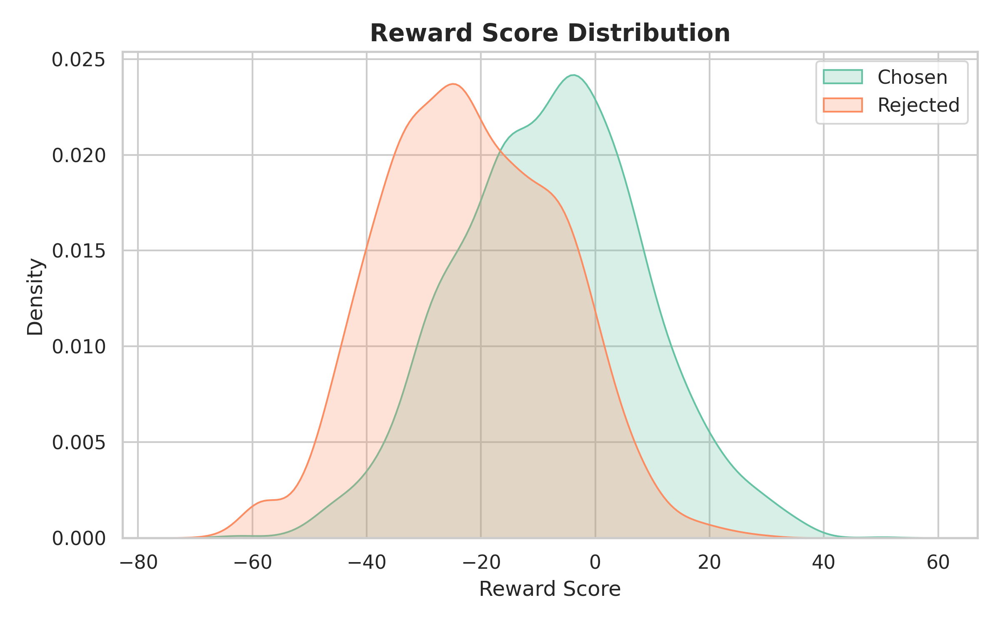
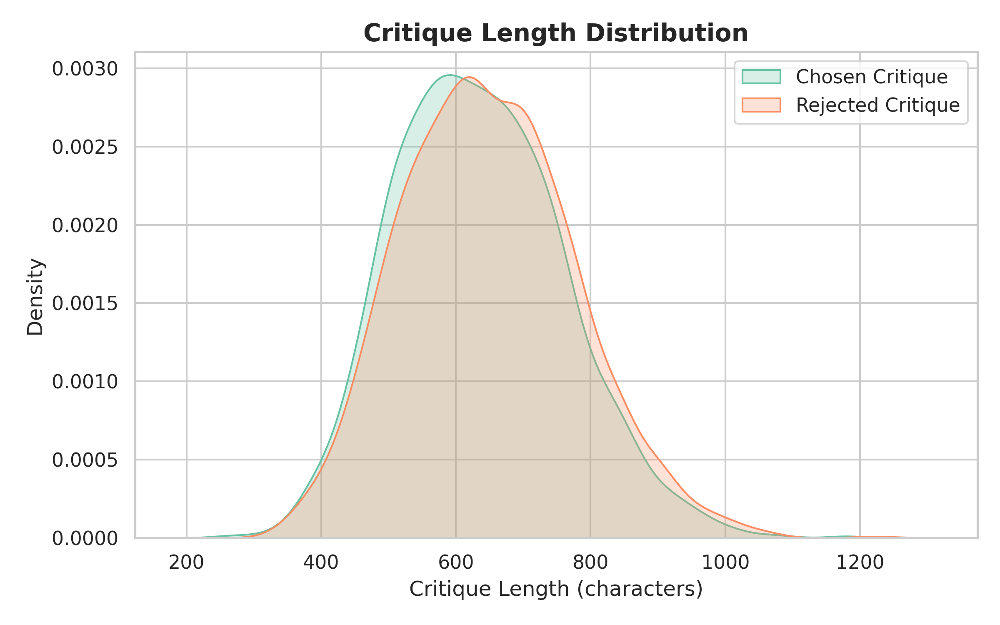

# Reward-Bench

本目录包含与 **Reward-Bench** 相关的评测与分析工具，包括：

- **评测脚本**：`reward_bench_eval.py` `reward_bench2_eval.py`，用于运行 Reward-Bench benchmark
- **数据分析工具**：`run_analysis.py`，用于对评测结果进行统计与可视化

## 📂 目录结构
```
reward_bench/
├─ data/                     # Reward-Bench 原始数据
│  ├─ reward-bench
│  └─ reward-bench-2
├─ figures/                  # 分析输出图表（运行后生成）
├─ reward_bench_eval.py      # reward-bench-1 评测脚本
├─ reward_bench2_eval.py     # reward-bench-2 评测脚本
├─ run_analysis.py           # 数据分析与可视化工具
└─ README.md
```

## 评测脚本

根据`reward-bench`和`reward-bench-2`两个数据集的特点，进行分类评测，可在其中加入自己模型的调用代码，输出`data/reward_results.json`文件。

## 📦 数据格式示例

评测脚本会输出结果文件，每条数据包含`chosen`和`rejected`的批判和分数(前面是`id`)，格式如下：

```json
{
  "30-chosen": {
    "critique": "In terms of helpfulness, xxx",
    "reward_score": 17.25
  },
  "30-rejected": {
    "critique": "In terms of helpfulness, xxx",
    "reward_score": -23.5
  }
}
````

## 🚀 数据分析工具

分析脚本入口：`run_analysis.py`
它会读取评测结果，并输出统计图表和错误分析。

---

## 📊 输出结果

运行完成后，将在 `figures/` 文件夹中生成以下文件：

* `score_distribution.png`

  奖励分数分布（chosen vs rejected）

* `score_diff_distribution.png`

  分数差分布（chosen - rejected）

* `accuracy_vs_score_diff.png`

  准确率随分数差变化趋势

* `critique_length_distribution.png`

  批判长度分布

* `error_cases.txt`

  错误样本详情（高分 rejected / 低分 chosen），直观感受模型薄弱样本

---

## 📈 示例图表

奖励分数分布



批判长度分布


